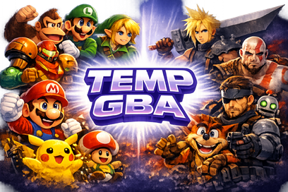

<p align="center">
  
</p>

<h1 align="center">TempGBA4PSP-mod</h1>

<p align="center">
  <strong>A modernized Game Boy Advance emulator for PlayStation Portable</strong><br>
  Built on TempGBA / gpSP, with ongoing accuracy, performance, UI, and compatibility work.
</p>

<p align="center">
  <a href="https://github.com/andymcca/TempGBA4PSP-mod">GitHub</a> ·
  <a href="BUILD-DOCKER.md">Docker build</a> ·
  <a href="https://github.com/GrabowskiDev/TempGBA4PSP-Single-game">Single-game fork compatibility</a>
</p>

---

## About

**TempGBA4PSP-mod** is a maintained PSP port of TempGBA (itself based on [phoe-nix’s TempGBA lineage](https://github.com/phoe-nix) and the classic gpSP dynarec core). This tree focuses on real-hardware PSP usability: better menus, stronger game compatibility, dynarec/video accuracy fixes pulled from upstream libretro/gpSP work, and performance options tuned for Allegrex.

It remains a homebrew GBA emulator — you need a legal BIOS dump (`gba_bios.bin`) and your own ROMs.

---

## Highlights

| Area | What’s new |
|------|------------|
| **UI** | Themes, custom colors, multi-language menus, X/O confirm swap, Graphics Options submenu |
| **Video** | Dual renderer (classic + PR258/`video.cc`), 16:9 fullscreen, OAM hijack toggle, optional PSP VSync |
| **Performance** | LTO builds, Allegrex blend opts, sticky ROM paging, SWI HLE, EWRAM stack fast paths, RAM JIT reuse modes |
| **Accuracy** | Dynarec flag fixes, sound I/O masks, OAM/affine/HBlank IRQ fixes, `game_config` SMC gates |
| **Install** | Custom XMB icon/splash, drop-in single-game (`roms/game.gba`) auto-detect |
| **Compat** | Fixes for titles that previously failed or glitched (see below) |

---

## Features in detail

### Interface & usability

- **UI overhaul (PR #20)** — redesigned menus with clearer Graphics / Emulator options layout.
- **Theme system** — nine presets (Original, Dark, Light, Blue, Green, Red, Purple, High Contrast, Retro), plus a **custom color picker** (background, active/inactive items, help text, scroll bar, battery colors, and more). Themes can be saved independently of global config.
- **Internationalization** — menu strings in **Japanese, English, Simplified Chinese, Traditional Chinese, and Italian**.
- **Confirm button swap** — choose **O confirms** or **X confirms** (PSP-region style). Older `tempgba.cfg` files written before these slots were added still load correctly.
- **Savestate UX** — details save/load fixes; leaving the menu after state operations behaves more predictably.
- **Menu polish** — fixed `%s` label formatting, restored cursor repeat speed, and earlier crash/text issues between game ↔ menu transitions.

### Display & graphics

- **16:9 fullscreen** scale mode (GU path) alongside classic 1× / 1.5× GU / 1.5× software / user scale.
- **Dual video renderer dispatch** — Old vs New (see [Video renderers](#video-renderers) below).
- **OAM hijack support** — optional toggle for the New renderer when titles rewrite OAM mid-frame.
- **PSP VSync** — optional wait-for-vblank on present (Graphics menu).
- **MIPS blend path** — uses Allegrex `ins` and `maddu` in `expand_blend_mips` for fewer instructions per blended pixel.
- **HBlank IRQ scanline window** — tunable start/end lines (see [HBlank IRQ range](#hblank-irq-range) below).
- **Affine / BG fixes** — corrected affine background reference updates (including BG3) and related old-renderer bugs.

### Performance & dynarec

- **Link-time optimization (LTO)** enabled in the PSP build for better cross-unit inlining and code layout.
- **Thumb ROM PC-pool loads** — same-page `LDR rd,[pc,#imm]` folded into immediates in the dynarec where safe.
- **Sticky ROM page cache** — reduces gamepak paging thrash on large ROMs under memory pressure.
- **Gamepak buffer allocation** — improved sizing, with 1 MiB step-down after a failed 16 MiB attempt so more PSP configs can still run big carts.
- **Shared ROM load stubs** across mirrored gamepak regions `0x08`–`0x0B`.
- **BIOS SWI vector** precompiled and pinned for direct block linking.
- **Inline HLE** for `Div` / `DivArm` SWIs to avoid BIOS trap overhead on hot paths.
- **EWRAM fast path** for SP-relative `LDM`/`STM` stack traffic.
- **RAM dynarec modes** — Full flush / Partial no reuse / Partial + reuse (see [Dynarec modes](#dynarec-modes) below).
- **IRQ delay cycle accounting** fixes for more stable timing-sensitive titles.

### Accuracy & game_config

- **ADCS / SBCS / RSCS flag codegen** — MIPS dynarec fix ported from [libretro/gpsp](https://github.com/libretro/gpsp) (`88454e9`) so carry-with-borrow instructions set C/V correctly.
- **Sound I/O write masks** — unused bits masked on sound control registers (matching hardware / libretro), which helps accuracy checks in FireRed-derived ROM hacks.
- **OAM sorting / visibility fixes** from libretro-gpsp applied to the old renderer.
- **`game_config.txt` improvements**
  - Multiple `idle_loop_eliminate_target` and `smc_cutpoint` lines per game (see [Compatibility notes](#game_configtxt--idle-loops--smc-cutpoints)).
  - Optional **`filename_match`** when multiple ROMs share the same header.
  - M4A / IWRAM SMC gates for problematic audio engines (e.g. Pokémon Unbound / Odyssey).
- **`REG_MOSAIC`** correctly represented in the I/O register enum.

### Branding & packaging

- Custom **XMB icon** (`ICON0` / `icon.png`) and **background splash** (`PIC1` / `icon_big.png`) embedded in `EBOOT.PBP`.
- Makefile wired for current PSP SDK / Docker `pspdev` images.

### Single-game installs

This build auto-detects [GrabowskiDev single-game](https://github.com/GrabowskiDev/TempGBA4PSP-Single-game) folder layouts. If `roms/game.gba` exists, the emulator loads it on startup with **no ROM browser**. Multi-ROM installs are unchanged when `game.gba` is absent.

To upgrade an existing single-game folder, copy these from a fresh build (keep your custom `PBOOT.PBP`, `roms/game.gba`, and saves):

- `EBOOT.PBP`
- `DATA.PSP`
- `TempGBA.prx`
- `exception.prx`
- `ku_bridge.prx` (if present)
- `gba_bios.bin`

| Path | Purpose |
|------|---------|
| `roms/game.gba` | ROM (unzipped) |
| `save/game.sav` | Battery save |
| `state/game_*.svs` | Save states |
| `cfg/game.cfg` | Per-game settings |
| `dir.ini` | Directory paths (`rom_directory = roms`, etc.) |

---

## Advanced tuning

These options live under **Graphics Options** (video) and **Emulator Options** (dynarec / HBlank). Defaults are chosen for broad compatibility; per-game tweaks can reclaim a lot of speed on real PSP hardware.

### HBlank IRQ range

GBA games can raise an **HBlank IRQ** on every scanline. That is required for some raster effects (status bars, warped backgrounds, mid-frame palette/OAM tricks), but firing IRQs on every line is expensive on PSP.

TempGBA exposes a **start** and **end** scanline window. HBlank IRQs are only raised when the current line falls inside that inclusive range.

| Setting | Behavior |
|---------|----------|
| **Either start or end = `0`** | Window is **off**. HBlank IRQs are allowed on all lines (closest to unrestricted hardware behavior). Required for some games to display graphics and text correctly e.g. Advance Wars |
| **`1`–`160`** (default `1`–`160`) | IRQs only during the **visible** screen area. |
| **`1`–`161`** | Practical **gpSP-kai-style** window: visible lines plus the first post-visible line. A good balanced preset when you want kai-like timing without hand-tuning. e.g. gives better performance in Penny Racers without messing up graphics |
| **`1`–`1`** | Effectively **disables almost all HBlank IRQs** (only line 1 can fire). Often makes games run **noticeably faster**, but mid-frame visual effects that depend on HBlank may glitch, disappear, or tear. Useful for better game performance at the expense of missing effects e.g. **Pokemon Unbound**|
| **End in `161`–`227`** | Extends the window into **vblank-region** lines when a game still needs IRQs there. |

**Tips**

- Start with the default (`1`–`160`) or the kai-like (`1`–`161`) preset.
- If a title is slow but looks fine without fancy scanline effects, try `1`–`1` as a speed hack.
- If effects break (wrong HUD, missing warps, palette flicker), widen the window or set one value to `0` to turn the limiter off.
- Settings are saved with other options and can differ per game via per-game config.

### Dynarec modes

Under Emulator Options, **Block checksum reuse** (RAM dynarec policy) controls how the JIT treats code that lives in writable RAM (IWRAM / EWRAM / VRAM code).

| Mode | What it does | Best for |
|------|----------------|----------|
| **Partial + reuse** (default) | On RAM writes, clear only the affected metadata; if the same block bytes reappear later, **reuse** the already-compiled native code. Fastest when games self-modify or reload similar code often. | **Mario Golf**, **Mario Tennis**, **Pokémon Unbound**, and other SMC-heavy / RAM-code titles |
| **Partial no reuse** | Partial invalidation only — changed blocks are recompiled, but prior native code is **not** reused even if bytes match. Middle ground. | Cases where reuse causes odd glitches but full flush is too slow |
| **Full flush** | Any relevant RAM change **flushes the whole writable translation cache**. Safer for games that depend on **block linking** into RAM targets, at the cost of more recompiles. | **Castlevania** and similar titles that rely on stable linked blocks into RAM |

**Tips**

- Leave **Partial + reuse** on unless you see wrong code execution, random crashes after SMC, or “works once then breaks” behavior.
- Switch to **Full flush** when a game needs correct branch linking into RAM and the partial modes misbehave.
- This is independent of ROM-side dynarec; it only changes writable-RAM JIT policy.

### Video renderers

Graphics Options → **Video renderer** selects the scanline engine. **OAM hijack** applies only to the **New** renderer.

| Option | Strengths | Trade-offs |
|--------|-----------|------------|
| **Old** | Generally **quicker** on PSP. Classic TempGBA path with OAM/affine fixes backported from libretro/gpSP. | Less accurate blending / object edge cases; a few remaining visual bugs vs hardware. |
| **New** | **More compatible** — rewritten path aligned with libretro gpsp / PR258 `video.cc` (better blend and OBJ handling). | Heavier than Old on some titles. |
| **New + OAM hijack ON** | Closest practical option to **hardware-like** video when games rewrite OAM mid-frame or otherwise confuse sprite sorting. | Extra work on top of New; only useful when the game actually needs it. |

**Tips**

- Prefer **Old** when chasing framerate and the game already looks correct.
- Prefer **New** as the compatibility default (and it is the build default).
- Turn on **OAM hijack** only if sprites / windows still glitch under New; leave it off otherwise.

---

## Compatibility notes

### Games improved or fixed in this line

Titles that previously failed to boot, crashed, glitched, or were unusable and now run much better include:

- NBA Jam 2002
- Colin McRae Rally
- Banjo-Kazooie: Grunty’s Revenge
- Starsky & Hutch
- [Balatro (GBA port)](https://github.com/cellos51/balatro-gba)
- **Celia’s Stupid ROM Hack** (FireRed decomp ROM hack) — sound I/O write masks now match hardware unused-bit behavior, so the hack’s emulator accuracy checks no longer false-fail
- **Kingdom Hearts: Chain of Memories** — intro / opening sequence no longer breaks (dynarec flag accuracy and related timing work)
- …and other edge cases addressed via IRQ, SMC, affine, and sound I/O fixes

### `game_config.txt` — idle loops & SMC cutpoints

Ship `game_config.txt` next to the EBOOT (same folder as a classic TempGBA install). Recent work extended the loader so entries can use **multiple** `idle_loop_eliminate_target` lines, **`smc_cutpoint`** gates, and optional **`filename_match`** when several ROMs share the same header (common for FireRed-based hacks).

| Directive | Purpose |
|-----------|---------|
| `idle_loop_eliminate_target` | Marks a PC as an idle spin so the dynarec can skip ahead and sync hardware — big speed wins on wait loops |
| `smc_cutpoint` | Forces a JIT block boundary at an IWRAM/EWRAM address so self-modifying audio/code engines (e.g. M4A mixers) invalidate cleanly under partial dynarec |
| `filename_match` | Disambiguates ROMs that reuse the same `game_name` / `game_code` / `vender_code` (match is against the ROM filename) |

**Examples added or expanded in this tree:**

| Title | What the entry does |
|-------|---------------------|
| **Pokémon Unbound** | `filename_match = Unbound` + M4A-oriented `smc_cutpoint` list (IWRAM mixer / SoundMainRAM region) so large FireRed-based hacks stay stable under partial + reuse |
| **Pokémon Odyssey** | Same FireRed header, `filename_match = Odyssey`, plus multiple `idle_loop_eliminate_target` PCs and the Unbound-style `smc_cutpoint` set |
| **Geometry Advance (`GD_ADV`)** | Multiple idle-loop targets and `smc_cutpoint`s for a title that otherwise thrashes the JIT |
| **Final Fantasy VI Advance — SNES Audio Restoration** | `smc_cutpoint` gates for the restored audio engine’s IWRAM code |
| **Sega Arcade Gallery** | Multiple idle-loop targets and `smc_cutpoint`s for smoother multi-game collection performance |

Copy an updated `game_config.txt` when upgrading an install; per-game menu settings (renderer, HBlank window, dynarec mode) still live in `cfg/` / `tempgba.cfg` and complement these database entries.

### PPSSPP

On PPSSPP, use **software rendering**. Hardware rendering is not a supported path for this build.

### BIOS

Place a valid `gba_bios.bin` next to the EBOOT (or as configured in your install). Boot-from-BIOS remains available in Emulator options when you want the real boot sequence.

---

## Building

On Windows, use **Docker Desktop** and the official PSPDev image. Full commands and notes: **[BUILD-DOCKER.md](BUILD-DOCKER.md)**.

```powershell
docker run --rm `
  -v "C:/path/to/TempGBA-2025/source:/build" `
  -w /build `
  pspdev/pspdev:latest `
  make
```

Artifacts (`EBOOT.PBP`, `TempGBA.prx`, etc.) are written under `source/` on the host.

---

## Repository layout

| Path | Role |
|------|------|
| `source/` | Emulator sources, Makefile, assets, build output |
| `BUILD-DOCKER.md` | Docker / PSPDev build instructions |
| `game_config.txt` | Optional per-game idle-loop / SMC / timing tweaks |
| `docs/` | Investigation notes (performance, video, etc.) |

---

## Credits & lineage

- **gpSP** — Exophase / notaz and contributors
- **TempGBA** — Nebuleon and the TempGBA community
- **PSP ports / prior mods** — phoe-nix lineage and earlier TempGBA4PSP work
- **libretro/gpsp** — upstream accuracy and renderer fixes ported into this tree
- **UI themes / i18n / X/O swap** — contributors to PR #20
- **Single-game layout** — compatible with [GrabowskiDev/TempGBA4PSP-Single-game](https://github.com/GrabowskiDev/TempGBA4PSP-Single-game)
- **This mod** — [andymcca/TempGBA4PSP-mod](https://github.com/andymcca/TempGBA4PSP-mod)

---

## License

Follow the licenses of the upstream gpSP / TempGBA sources included in this repository. Homebrew use only; dump your own BIOS and use legally obtained ROMs.
